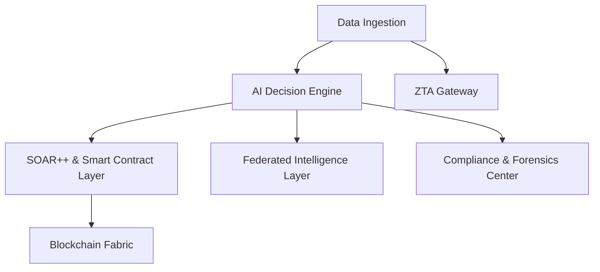

# 🚀 CyberDefenseX - ML and Blockchain powered automated SIEM and SOAR platform
**Autonomous. Transparent. Unbreakable.**  

> The world’s first **fully autonomous AI + Blockchain + Smart Contract + Self-Healing Cyber Defense System** with analyst-grade explainability and federated global intelligence.  

---

## ✨ Core Capabilities  
✅ **90%+ Analyst-Free SOC Automation** – AI-driven triage, response, and reporting  
✅ **Explainable AI (XAI)** – attention-based models, LIME, SHAP, and interactive heatmaps  
✅ **Blockchain + Smart Contracts** – tamper-proof logging + autonomous SOAR workflows  
✅ **Self-Healing Systems** – auto-detects and remediates threats in real time  
✅ **Federated Threat Intelligence** – global learning without data sharing, STIX/TAXII ready  
✅ **Zero Trust Architecture (ZTA)** – adaptive trust scoring + continuous authentication  
✅ **MITRE ATT&CK + XDR Mapping** – endpoint, network, and cloud telemetry correlation  
✅ **One-Click Compliance Reporting** – SOC2, ISO27001, NIST with forensic replay  

---

## 🏗️ Architecture  



1. **Data Ingestion** – Syslog, Cloud, Endpoint, IoT/OT agents, APIs  
2. **AI Decision Engine** – Hybrid anomaly detection + behavior rules + XAI  
3. **SOAR++ & Smart Contract Layer** – Visual playbook designer + blockchain validation  
4. **Blockchain Fabric** – Ethereum/Hyperledger, IPFS storage, Merkle hashing  
5. **Federated Intelligence Layer** – Privacy-safe weight sharing  
6. **ZTA Gateway** – Adaptive access control + session risk scoring  
7. **Compliance & Forensics Center** – Automated reports + historical replay  

---

## 🛠️ Tech Stack  

**Frontend**  
- ⚛️ ReactJS  

**Backend & AI**  
- 🐍 Python: Flask, FastAPI  
- 📊 Scikit-learn, Pandas, NumPy  
- 🧠 XAI: SHAP, LIME, Attention Models  
- 🌐 Scapy (network traffic analysis)  

**Blockchain & Smart Contracts**  
- 🔗 Solidity  
- 🌍 Web3  
- ⛓️ Ethereum / Hyperledger Fabric  
- 📦 IPFS  

**Database**  
- 🗄️ SQLite  

---
## System Architecture


---
## 🎯 Target Users


- 🛡️ National & Enterprise SOC Teams  
- 🏛️ Government Cyber Defense Units  
- ⚡ Critical Infrastructure Operators  
- ☁️ Cloud & Managed Security Providers  
- 🎓 Academic & Research Labs  

---

## 📂 Project Structure  

```
CyberDefendX/
│
├── frontend/                 # ReactJS dashboard (UI)
│   ├── public/               # Static files
│   └── src/                  # Components, pages, services
│
├── backend/                  # Python backend (Flask + FastAPI)
│   ├── ai_engine/            # ML models, anomaly detection, XAI
│   ├── soar/                 # SOAR workflows & playbook logic
│   ├── zta_gateway/          # Zero Trust enforcement
│   ├── forensics/            # Compliance & forensic replay
│   └── app.py                # Entry point
│
├── blockchain/               # Blockchain + Smart Contracts
│   ├── contracts/            # Solidity contracts
│   ├── scripts/              # Deployment & testing scripts
│   └── fabric/               # Hyperledger components
│
├── federated/                # Federated learning & threat intelligence
│   ├── model_sharing/        # Privacy-safe weight exchange
│   └── stix_taxii/           # Standards compliance
│
├── docs/                     # Documentation & architecture diagrams
│
└── README.md                 # Project overview
```

---

## ⚡ Quick Start  

```bash
# Clone repo
git clone https://github.com/your-username/CyberDefendX.git
cd CyberDefendX

# Setup backend
cd backend
pip install -r requirements.txt
python app.py

# Setup frontend
cd frontend
npm install
npm start
```

---

## 📜 Roadmap  

- [ ] 🔐 Enhance blockchain fabric with zk-SNARKs  
- [ ] 🧠 Add reinforcement learning for adaptive threat response  
- [ ] 📡 Expand IoT/OT security agent support  
- [ ] 🛰️ Multi-cloud federation for global SOC collaboration  

---

## 🤝 Contributing  

Pull requests are welcome! For major changes, please open an issue first to discuss what you would like to change.  

---

## 📄 License  

MIT License – feel free to use, modify, and distribute with attribution.  
