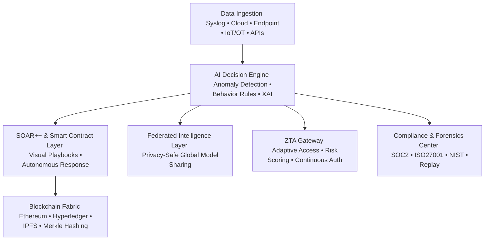

# 🚀 CyberDefenseX - ML and Blockchain powered automated SIEM and SOAR platform
**Autonomous. Transparent. Unbreakable.**  

> The world’s first **fully autonomous AI + Blockchain + Smart Contract + Self-Healing Cyber Defense System** with analyst-grade explainability and federated global intelligence.  

---

## ✨ Core Capabilities  
✅ **90%+ Analyst-Free SOC Automation** – AI-driven triage, response, and reporting  
✅ **Explainable AI (XAI)** – attention-based models, LIME, SHAP, and interactive heatmaps  
✅ **Blockchain + Smart Contracts** – tamper-proof logging + autonomous SOAR workflows  
✅ **Self-Healing Systems** – auto-detects and remediates threats in real time  
✅ **Federated Threat Intelligence** – global learning without data sharing, STIX/TAXII ready  
✅ **Zero Trust Architecture (ZTA)** – adaptive trust scoring + continuous authentication  
✅ **MITRE ATT&CK + XDR Mapping** – endpoint, network, and cloud telemetry correlation  
✅ **One-Click Compliance Reporting** – SOC2, ISO27001, NIST with forensic replay  

---
## System Architecture


---

1. **Data Ingestion** – Syslog, Cloud, Endpoint, IoT/OT agents, APIs  
2. **AI Decision Engine** – Hybrid anomaly detection + behavior rules + XAI  
3. **SOAR++ & Smart Contract Layer** – Visual playbook designer + blockchain validation  
4. **Blockchain Fabric** – Ethereum/Hyperledger, IPFS storage, Merkle hashing  
5. **Federated Intelligence Layer** – Privacy-safe weight sharing  
6. **ZTA Gateway** – Adaptive access control + session risk scoring  
7. **Compliance & Forensics Center** – Automated reports + historical replay  

---

## 🛠️ Tech Stack  

**Frontend + Backend/AI**                                         | **Blockchain + Database**
------------------------------------------------------------------|--------------------------------------
⚛️ ReactJS                                                        | 🔗 Solidity  
🐍 Python: Flask, FastAPI                                         | 🌍 Web3  
📊 Scikit-learn, Pandas, NumPy                                    | ⛓️ Ethereum / Hyperledger Fabric  
🧠 XAI: SHAP, LIME, Attention Models                              | 📦 IPFS  
🌐 Scapy (network traffic analysis)                               | 🗄️ SQLite  


---
## 🏗️ Flow Diagram  


## 🎯 Target Users


- 🛡️ National & Enterprise SOC Teams  
- 🏛️ Government Cyber Defense Units  
- ⚡ Critical Infrastructure Operators  
- ☁️ Cloud & Managed Security Providers  
- 🎓 Academic & Research Labs  

---

## 📂 Project Structure  

```
CyberDefenseX/
│
├── frontend/                 # ReactJS dashboard (UI)
│   ├── public/               # Static files
│   └── src/                  # Components, pages, services
│
├── backend/                  # Python backend (Flask + FastAPI)
│   ├── ai_engine/            # ML models, anomaly detection, XAI
│   ├── soar/                 # SOAR workflows & playbook logic
│   ├── zta_gateway/          # Zero Trust enforcement
│   ├── forensics/            # Compliance & forensic replay
│   └── app.py                # Entry point
│
├── blockchain/               # Blockchain + Smart Contracts
│   ├── contracts/            # Solidity contracts
│   ├── scripts/              # Deployment & testing scripts
│   └── fabric/               # Hyperledger components
│
├── federated/                # Federated learning & threat intelligence
│   ├── model_sharing/        # Privacy-safe weight exchange
│   └── stix_taxii/           # Standards compliance
│
├── docs/                     # Documentation & architecture diagrams
│
└── README.md                 # Project overview
```

---

## ⚡ Quick Start  

```bash
# Clone repo
git clone https://github.com/your-username/CyberDefenseX.git
cd CyberDefenseX

# Setup backend
cd backend
pip install -r requirements.txt
python app.py

# Setup frontend
cd frontend
npm install
npm start
```

---

## 📜 Roadmap  

- [ ] 🔐 Enhance blockchain fabric with zk-SNARKs  
- [ ] 🧠 Add reinforcement learning for adaptive threat response  
- [ ] 📡 Expand IoT/OT security agent support  
- [ ] 🛰️ Multi-cloud federation for global SOC collaboration  

---

## 🙌 Honorable Mentions

A big thank you to all the amazing contributors who have helped shape **CyberDefenseX** 🚀  

## 👨‍💻 Core Contributors  

<table>
  <tr>
    <td align="center" width="300px">
      <a href="https://github.com/shuvojitss">
        
        <br />
        <span style="font-size:16px; font-weight:bold;">Shuvojit Samanta</span>
      </a>
      <br />
      <span style="font-size:14px;">Project Architect & AI/ML Engineer</span>
    </td>
    <td align="center" width="300px">
      <a href="https://github.com/gitadak">
        
        <br />
        <span style="font-size:16px; font-weight:bold;">Soumyadeep Adak</span>
      </a>
      <br />
      <span style="font-size:14px;">Blockchain & Smart Contracts Developer</span>
    </td>
    <td align="center" width="300px">
      <a href="https://github.com/Piyush-Sarkar">
        
        <br />
        <span style="font-size:16px; font-weight:bold;">Piyush Sarkar</span>
      </a>
      <br />
      <span style="font-size:14px;">Researcher & Frontend Designer</span>
    </td>
    <td align="center" width="300px">
      <a href="https://github.com/imon005">
        
        <br />
        <span style="font-size:16px; font-weight:bold;">Imon Purkait</span>
      </a>
      <br />
      <span style="font-size:14px;">Ethical Hacker & Cybersecurity Specialist</span>
    </td>
  </tr>
</table>


## 🤝 Contributing  

Pull requests are welcome! For major changes, please open an issue first to discuss what you would like to change.  

---


### Special Thanks
- All community testers, researchers, and supporters for making **CyberDefenseX** better each day 🙏  

---

## 🌟 Contribute
Want to see your name here?  
Check out our [Contributing Guide](CONTRIBUTING.md) and join the mission!


## 📄 License  

MIT License – feel free to use, modify, and distribute with attribution.  
